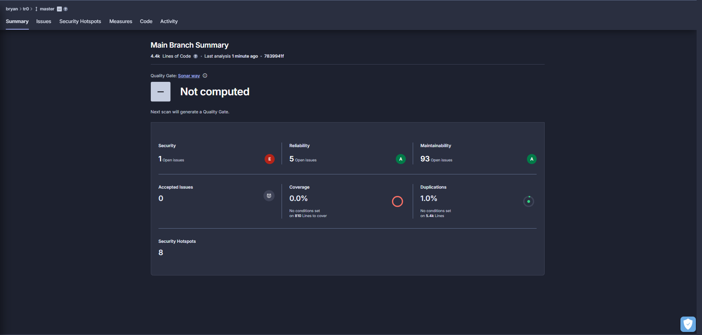

# Projecte 1: App Trivia de Banderes

## Objectiu del Projecte
Aquesta aplicació web permet als usuaris jugar a un joc de preguntes sobre banderes de països. L’objectiu és aprendre i posar a prova els coneixements de geografia d’una manera divertida i interactiva.

## Relació amb l’Objectiu de Desenvolupament Sostenible (ODS)
Aquest projecte s’alinea amb l’ODS 4: Educació de Qualitat. L’aplicació fomenta l’aprenentatge global, la curiositat i el coneixement sobre la diversitat cultural i geogràfica del món.

## Característiques Principals
- Joc de preguntes amb banderes de països
- Estadístiques de resultats i rànquing
- Disseny responsiu per a dispositius mòbils
- Gestió d’usuari amb nom personalitzat

## Bones Pràctiques i Qualitat del Codi
- El codi segueix la guia d’estil StandardJS
- S’han afegit comentaris clars a la lògica complexa
- El repositori utilitza Git amb branques i commits regulars
- S’ha analitzat la qualitat del codi amb SonarCloud

## Desplegament
L’aplicació està desplegada automàticament a [Vercel/Netlify](URL_AQUI).

## Enllaços
- **Repositori GitHub:** https://github.com/BryanRuzafaGon/tr0
- **App desplegada:** http://a24bryruzgon.daw.inspedralbes.cat/client/
- **Dashboard SonarCloud:** 
- **Video:**

---
